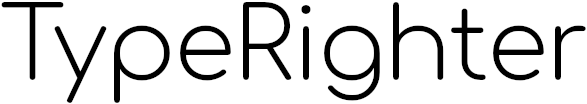

Data Types for Cynical Humans™

## Overview

Welcome to Typerighter, a project that makes it easy to structure and process data using concepts from type systems. 

The project's goal is to offer a simple system for the usual data plumbing needs in a way that causes users to write clear and simple code, even when the data comes from complex and dirty sources.

### Similarity to Schematics

I am also the original author of Schematics. I gave the project to the community a while back and have used several other languages since then, which gave me reason to think I could approach the problem in a new and interesting way.

So here we are.
